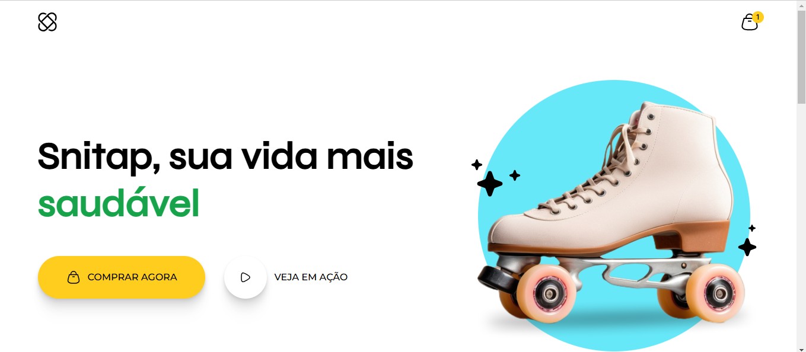
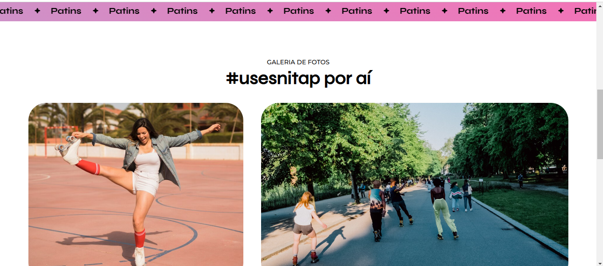
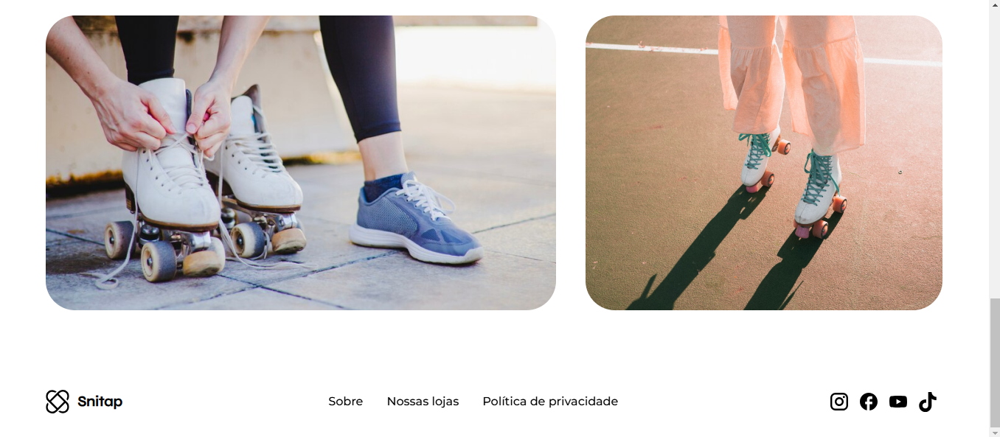

<h1 align="center">Snitap Patins</h1>

O projeto será a criação de uma Landpage onde irei trabalhar com CSS Animations & Transitions. 
<a href="https://app.rocketseat.com.br/">Estude esse projeto em formato de vídeo clicando aqui.</a>

  <a href="#-tecnologias">Tecnologias</a>&nbsp;&nbsp;&nbsp;|&nbsp;&nbsp;&nbsp;
  <a href="#-projeto">Projeto</a>&nbsp;&nbsp;&nbsp;|&nbsp;&nbsp;&nbsp;

 

  

  

  

## 🚀 Tecnologias

Esse projeto foi desenvolvido com as seguintes tecnologias:

- HTML e CSS
- Figma

## 💻 Projeto

O projeto será a criação de uma Landpage onde irei trabalhar com CSS Animations & Transitions. 
 
Neste projeto, vamos trabalhar animações e transições no CSS, utilizando uma landpage de patins no Figma. Vamos explorar animações ao clicar em elementos, transições ao passar o mouse e uma animação de scroll.

- [Acesse o projeto finalizado, online](https://editonr.github.io/LP_PATINS/)

---

Um projeto ensinado com ♥ by Rocketseat e replicado com carinho by Eddie ♥ : [Participe da nossa comunidade!](https://discord.gg/rocketseat)